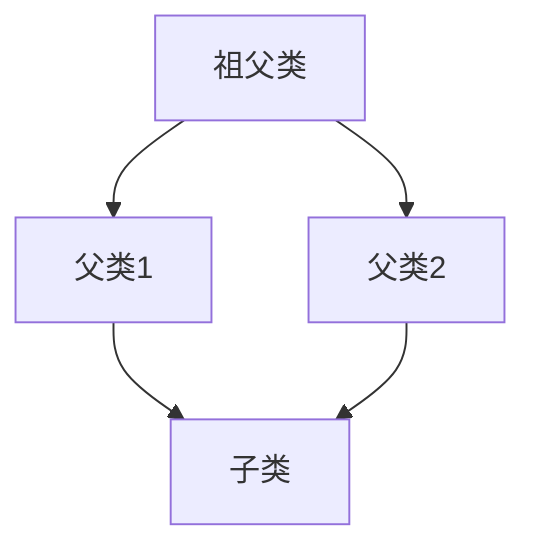

## 继承格式

```
class <派生类名> : <继承权限1> <基类名1>, <继承权限2> <基类名2>, … {
    <派生类新定义成员>
};
```

## 构造顺序

定义派生类对象时，构造函数的执行顺序和派生类定义时继承的顺序保持一致。

## 析构顺序

销毁派生类对象时，析构函数的执行顺序和派生类定义时继承的顺序相反。

## 基类中同名成员

基类中存在同名的变量时，在派生类对象中必须要在**变量名前加上作用域**才能访问。

```cpp
class Father {
public:
    std::string name;
    Father () { name = "father"; }
};

class Mother {
public:
    std::string name;
    Mother() { name = "mother"; }
};

class Son : public Mother, public Father { };

int main()
{
    Son son;
    // 编译报错
    std::cout << son.name << std::endl;

    // 正确用法
    std::cout << son.Father::name << std::endl;
    std::cout << son.Mother::name << std::endl;
}
```

## **内存布局**

在多继承场景中，**如果基类中都有虚函数，则派生类中会存在多个虚表指针**。

```cpp
#include <iostream>
#include <string>

class Father {
public:
    virtual void Func1() {}
    virtual void Func2() {}
};

class Mother {
public:
    virtual void Func() {};
};

class Son : public Mother, public Father { };

int main()
{
    Father father;
    std::cout << sizeof(father) << std::endl; // 输出8

    Mother mother;
    std::cout << sizeof(mother) << std::endl; // 输出8

    Son son;
    std::cout << sizeof(son) << std::endl;    // 输出16

}
```

## 菱形继承



菱形继承产生两个问题：

1.  **数据冗余**：`子类` 对象会包含**两份** `祖父类` 的成员变量。不仅浪费了内存，还会导致数据不一致。
1.  **二义性**：当通过 `子类` 对象访问 `祖父类` 的成员时，编译器不知道该走哪条路径：是走 `父类1` 继承的那份，还是 `父类2` 继承的那份？这会引发编译错误。


为了解决菱形继承带来的问题，C++ 引入了**虚拟继承**。它告诉编译器，`父类1` 和 `父类2` 在继承 `祖父类` 时，**后续的派生类都能共享 `祖父类` 类的唯一**一份副本。

```cpp
class Grandparent {
public:
    int value;
    Grandparent(int v) : value(v) {}
};

// 使用virtual进行虚拟继承
class Parent1 : virtual public Grandparent {
public:
    Parent1(int v) : Grandparent(v) {}
};

// 使用virtual进行虚拟继承
class Parent2 : virtual public Grandparent {
public:
    Parent2(int v) : Grandparent(v) {}
};

class Child : public Parent1, public Parent2 {
public:
    // 子类的构造函数必须直接负责初始化Grandparent
    Child(int v) : Grandparent(v), Parent1(v), Parent2(v) {}
};
```

**虚拟继承的原理**

+   **单一实例**：通过虚拟继承，`祖父类` 的成员在 `子类` 对象中只会存在**一份**，这解决了数据冗余问题。
+   **构造函数的调用**：在虚拟继承中，**最底层的派生类（`子类`）必须负责直接调用虚基类（`祖父类`）的构造函数**。
    +   `Parent1` 和 `Parent2` 的构造函数中对 `Grandparent` 的调用会被忽略。
    +   如果 `Child` 没有调用 `Grandparent` 的构造函数，编译器会报错。
    +   确保了 `Grandparent` 在整个继承体系中只会被构造一次。
+   **内存布局**：编译器会在派生类对象（`Parent1`、`Parent2` 和 `Child`）中添加一个**虚拟基类表指针（vbtpr）**。用于在运行时找到唯一的 `祖父类` 子对象。

```cpp
int main()
{
    std::cout << sizeof(Grandparent) << std::endl;  // 输出4
    std::cout << sizeof(Parent1) << std::endl;      // 输出16
    std::cout << sizeof(Parent2) << std::endl;      // 输出16
    std::cout << sizeof(Child) << std::endl;        // 输出24
}
```
