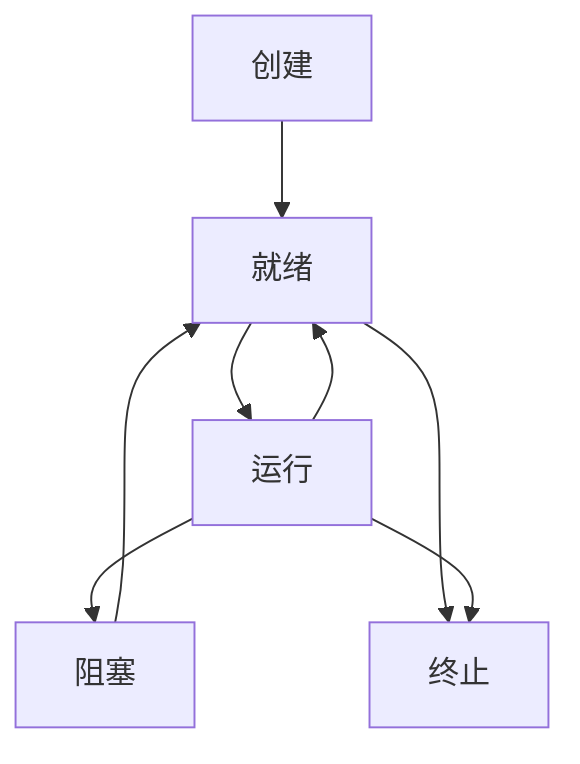

## 进程和程序
+ 程序：储存在外部存储的一个可执行文件。
+ 进程：在内存中运行，处于执行期间的程序。

## 进程和线程
+ 进程：是操作系统**资源分配**的基本单位，进程之间的地址空间和资源相互独立，一个进程至少有一个线程。
+ 线程：是处理器**任务调度和执行**的基本单位，同一进程的所有线程共享本进程的地址空间和资源。


## PCB
进程控制块 (Process Control Block, PCB) 就像是进程的身份证和档案袋，包含了操作系统管理和调度一个进程所需的所有信息。

PCB的主要作用：
+ 唯一标识进程： 操作系统通过 PCB 来唯一地标识一个进程。当一个进程被创建时，操作系统会为它分配一个唯一的 PID (进程 ID)，并将这个 PID 记录在它的 PCB 中。
+ 保存进程状态： PCB 存储着进程当前所处的状态（例如，运行、就绪、阻塞），这是进程调度的关键依据。
+ 支持进程调度： 调度程序通过访问 PCB 中的信息（如进程优先级、调度队列指针）来决定下一个要执行的进程。
+ 提供上下文切换信息： 当 CPU 发生上下文切换时，操作系统会将当前运行进程的 CPU 现场（寄存器值等）保存到它的 PCB 中，然后从下一个要运行进程的 PCB 中恢复其现场。
+ 管理资源分配： PCB 记录了进程所拥有的所有资源，例如打开的文件、分配的内存地址空间等。

操作系统通常会把所有PCB组织在一起，并通过链表、哈希表等数据结构进行管理。最常见的组织方式是按进程状态将PCB分别放入不同的队列中。
+ 就绪队列： 所有处于就绪状态的进程的PCB都被链接在一起。
+ 阻塞队列： 所有处于阻塞状态的进程的PCB都被链接在一起。一个特定的阻塞事件（如等待 I/O 完成）通常对应一个独立的阻塞队列。
+ 运行队列： 通常只有一个PCB位于运行队列，即当前正在CPU上执行的进程。


## 进程状态


## 进程ID
```c
// 获取当前进程ID
pid_t getpid();

// 获取当前进程的父进程ID
pid_t getppid();
```

## 进程创建

### fork()函数

fork函数从已存在进程中创建一个新进程。新进程为子进程，而原进程为父进程。
```c
#include <unistd.h>

pid_t fork();
```
进程调用fork后：
+ 分配新的内存块和内核数据结构给子进程。
+ 将父进程部分数据结构内容拷贝至子进程。
+ 添加子进程到系统进程列表当中。
+ fork返回，开始调度器调度。

fork函数时**调用一次，返回两次**。在父进程和子进程中各调用一次。子进程中返回值为0，父进程中返回值为子进程的PID。可以根据返回值的不同让父进程和子进程执行不同的代码。
> fork()函数创建子进程时，子进程的虚拟地址空间是父进程虚拟地址空间的精确副本。在现代操作系统中，为了提高效率，通常会采用写时复制（Copy-on-Write）机制。
> + 最初，父子进程的虚拟地址空间都映射到同一块物理内存上，它们共享相同的物理内存页面。
> + 当父进程或子进程尝试修改某个内存页面时，操作系统会检测到这个写操作，然后才为该进程创建该页面的一个独立副本。

### vfork()函数
```c
#include <unistd.h>

pid_t vfork();
```
fork创建子进程，把父进程数据空间、堆和栈复制一份；**vfork创建子进程，与父进程内存数据共享**。

vfork保证**子进程先执行**，当子进程调用exit()或者exec后，父进程才往下执行。

## 进程等待

### wait()
wait()暂停当前进程的运行，直到它的任意一个子进程终止。
```c
// status：获取子进程退出状态，不关心则可以设置成为NULL。
// return：成功时返回终止子进程的进程ID，出错时返回-1。
pid_t wait(int *status);
```

### waitpid()
waitpid()暂停当前进程的运行行，直到pid参数指定的子进程改变状态。
```c
pid_t waitpid(pid_t pid, int *status, int options);
```

pid:
+ pid = -1，等待任意一个子进程，与wait等效。
+ pid > 0，等待其进程ID与pid相等的子进程，等待指定的子进程。

waitpid()默认仅等待终止的子进程，但可以通过options参数进行修改。
options:
+ 如果设为0：默认，是阻塞式等待，与 wait 等效。
+ 如果设为WNOHANG：是非阻塞等待。

## 进程终止
+ return退出
  + main()函数中的return才能退出进程。 
+ exit退出
  ```c
  void exit(int status);
  
  void _exit(int status);
  ```
  + exit：在进程退出的时候，会进行后续资源处理（比如执行用户自定义的清理函数、刷新缓冲区、关闭所有流等）。
  + _exit：在进程退出的时候，不会进行后续资源处理，直接终止进程。


## 进程替换
用fork创建子进程后，子进程执行的是和父进程相同的程序（但可能是执行的是不同的流程），若想让子进程执行另一个程序，需要调用exec系列函数。

当进程调用exec系列函数时，该进程的用户空间代码和数据完全被新程序替换，并从新程序的启动例程开始执行。
1. 内核会将新程序（可执行文件）的代码、数据等内容加载到当前进程的地址空间中。
2. 原本运行的程序代码和数据会被完全覆盖。
3. 新程序从main函数开始执行。

 虽然程序本身被替换了，但进程的进程ID（PID）、父进程ID（PPID）以及打开的文件描述符等重息仍然不变。

 如果exec系列函数调用成功，它将永远不会返回。 因为调用它的旧程序已经被新程序覆盖了。如果exec函数返回了，那一定是失败了。

```cpp
int execl(const char *path, const char *arg, ...);
int execv(const char *path, char *const argv[]);

int execlp(const char *file, const char *arg, ...);
int execvp(const char *file, char *const argv[]);

int execle(const char *path, const char *arg, ..., char *const envp[]);
int execve(const char *path, char *const argv[], char *const envp[]);
```
exec系列函数命名规则：
+ l：代表 list。这表示参数以列表形式（即以逗号分隔的参数列表）传递，并且必须以 (char *)NULL 结尾。
+ v：代表 vector。这表示参数以数组（char *const argv[]）形式传递。
+ p：代表 path。这表示函数会在系统的 PATH 环境变量中查找可执行文件。如果没有这个字母，你必须提供可执行文件的完整路径。
+ e：代表 environment。这表示你可以自定义新进程的环境变量。如果没有这个字母，新进程会继承父进程的环境变量。


## 特殊进程

### 孤儿进程
当一个父进程在子进程终止之前终止时，子进程就会成为孤儿进程。

当父进程退出时，内核会检测其子进程的状态。如果子进程变成了孤儿，它会立即被PID为1的init进程（或 systemd）收养。

init进程将成为孤儿进程的新父进程，并负责在孤儿进程终止时回收其资源，以防止其变成僵尸进程。

### 僵尸进程

当一个子进程终止，而其父进程还没有调用 wait()或waitpid() 等函数来获取子进程的终止状态时，该子进程就会变成僵尸进程。
+ 僵尸进程已经释放了大部分资源（如代码、数据和堆栈），但其PCB仍然保存在内存中。
+ 僵尸进程的PCB占用了一部分内核内存，其中包含终止状态、退出码等信息。
+ 无法用kill命令杀死僵尸进程，因为它已经死亡了。
+ 唯一能清除僵尸进程的方法是等待其父进程调用 wait() 或 waitpid()，或者杀死其父进程，使其成为孤儿进程并被init进程收养。

### 守护进程

守护进程是一种在后台运行的特殊进程。它们通常在系统启动时被创建，并在整个系统生命周期中持续运行，不与任何控制终端关联。守护进程的名称通常以字母 d 结尾（例如 sshd、crond），这是一种约定俗成的命名方式。

创建守护进程的步骤
+ 调用fork(), 创建子进程。
+ 在父进程中调用exit, 终止父进程。
+ 子进程调用setsid()创建新的会话区，并脱离控制终端。
+ 再次fork()创建孙进程，并终止子进程，让孙进程成为非会话首进程，彻底断开与控制终端的潜在关联。
+ 将标准输入,标注输出,标准错误重定向到/dev/null

